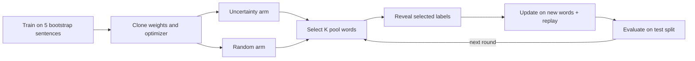

# uq-pet-token: token-level active learning for NER

Does a token classifier learn faster when each online update uses its most uncertain
unlabelled words instead of the same number of random words?

This is the token-level counterpart of
[DogRog/uq-pet](https://github.com/DogRog/uq-pet), which selects whole sentences by
LLM uncertainty and fine-tunes on them.

Experiments run on [PET](https://github.com/patriziobellan86/PETv1.1) by default, a
corpus of business-process descriptions annotated with 7 process entity types (actors,
activities, gateways, and others; 15 BIO tags). [CoNLL-2003](https://huggingface.co/datasets/eriktks/conll2003)
is available as a second dataset, and two more process corpora as third and fourth:
[Quishpi](https://github.com/PADS-UPC/atdp-extractor/tree/bpm2020/input) (process texts
with Action, Entity, and Condition spans) and
[MedicalProcessInstruks](https://huggingface.co/datasets/dagrat/MedicalProcessInstruks)
(English clinical guidelines with 19 unnamed process entity types). The supplied configurations cover DistilBERT, BERT,
RoBERTa, DeBERTa-v3, and ModernBERT.

The project includes:

- an interactive marimo experiment for one UQ metric against random;
- random-baseline hyperparameter tuning on a validation holdout;
- fixed comparisons of all three UQ metrics using the tuned winners;
- a fully supervised upper bound;
- resumable random hyperparameter sweeps; and
- read-only analysis notebooks for saved results.

## Contents

- [Quick start](#quick-start)
- [Protocol](#protocol): [data splits](#data-splits), [one run](#one-run),
  [UQ metrics](#uq-metrics), [invariants](#invariants)
- [Interactive experiment](#interactive-experiment)
- [Workflow](#workflow)
  1. [Tune the random baseline](#1-tune-the-random-baseline)
  2. [Compare UQ metrics with the winners](#2-compare-uq-metrics-with-the-winners)
  3. [Supervised upper bound](#3-supervised-upper-bound)
  4. [Analyze saved results](#4-analyze-saved-results)
  5. [Appendix: test-tuned random oracle](#5-appendix-test-tuned-random-oracle)
- [Random hyperparameter sweep](#random-hyperparameter-sweep)
- [Reference](#reference): [search space](#search-space), [resuming](#resuming),
  [concurrency and performance](#concurrency-and-performance),
  [Weights & Biases](#weights--biases), [legacy outputs](#legacy-outputs)
- [Development](#development): [checks](#checks), [layout](#layout),
  [agent skills](#agent-skills)

## Quick start

Use Python 3.12 or newer and `uv`. From the project root:

```bash
uv sync
uv run marimo edit notebooks/bert_token_uq.py
```

In the editor, choose settings and press **Run experiment** to start a real run. Real
runs download PET and model weights when needed; PET is cached at
`data/raw/PETv1.1-entities.jsonl`. Use `uv run marimo run notebooks/bert_token_uq.py`
for the app view without the code editor.

Running the notebook as a plain script (`uv run notebooks/bert_token_uq.py`) only
validates it with small synthetic display data. It downloads nothing and trains nothing.

To log to Weights & Biases, put `WANDB_API_KEY` in the environment or in a `.env` file
at the project root (see [Weights & Biases](#weights--biases)).

| Task | Entry point |
| --- | --- |
| Run one UQ metric against random | `notebooks/bert_token_uq.py` |
| Run every paper experiment, one parallel chain per dataset | `scripts/run_all_experiments.sh` |
| Tune random acquisition on a validation holdout | `scripts/tune_random_all_models.sh` |
| Compare all UQ metrics, top-K and with Gumbel noise, at the validation winners | `scripts/run_best_uq_all_models.sh` |
| Compare word form caps with the winners | `scripts/run_stochastic_uq_all_models.sh` |
| Run the appendix's test-tuned random oracle sweeps | `scripts/run_oracle_random_all_models.sh` |
| Tune and train the fully supervised upper bound | `scripts/run_supervised_all_models.sh` |
| Sample hyperparameters and compare UQ against random | `scripts/run_random_search_all_models.sh` |
| Inspect tuning completeness and winners | `notebooks/random_baseline_analysis.py` |
| Compare best-config UQ results and learning curves | `notebooks/best_uq_analysis.py` |
| Compare Gumbel noise and word form caps with top-K selection | `notebooks/acquisition_variants_analysis.py` |
| Compare UQ against the test-tuned random oracle (appendix) | `notebooks/oracle_random_analysis.py` |
| Inspect random-search test curves and selections | `notebooks/random_search_analysis.py` |

## Protocol



### Data splits

PET is split 80/20 into a train split and a test split with a fixed RNG seed. Five
train-split sentences become the bootstrap sentences and the rest form the pool:
**5 bootstrap, 328 pool, and 84 test sentences**. Setting `"dataset": "conll2003"` (or choosing it in the notebook) runs the
same protocol on CoNLL-2003, loaded from `eriktks/conll2003` at a pinned revision. Its
5 bootstrap sentences and pool (14,036 sentences) come from the CoNLL train split, and evaluation uses
the full CoNLL test split (3,453 sentences).

Setting `"dataset": "quishpi"` uses Quishpi et al.'s judge annotations from
`PADS-UPC/atdp-extractor` at a pinned commit: 18 process descriptions whose brat spans
become 7 BIO tags (Action, Entity, Condition). The texts are cut into words and
sentences in `data_prep.brat_sentences` and then split exactly like PET:
**5 bootstrap, 155 pool, and 41 test sentences**. 13 of the 18 texts are also PET
documents, so Quishpi is a coarser, sparser labelling of largely the same text rather
than a new domain.

Setting `"dataset": "medical"` uses MedicalProcessInstruks from the Hugging Face Hub at a
pinned revision. It is gated: accept its conditions on the dataset page and run
`uv run hf auth login` once before the first load. Its released train and test files are joined
and split exactly like PET, because the released test file is one guideline of 28
sentences: **5 bootstrap, 255 pool, and 65 test sentences**. The release names no tags,
so each type is named by its begin id (`B-T03`/`I-T03` … `B-T43`/`I-T43`; 39 BIO tags).
`docs/adr/0008-new-datasets-are-split-like-pet.md` records both choices.

The pool size (`dataset_percent`) keeps that percentage of the dataset's pool. Smaller
pools are nested prefixes of one seeded shuffle, and the bootstrap and test sentences do
not change.

### One run

For every model seed:

1. Fine-tune a fresh token classifier (15 PET tags, 9 CoNLL tags, 7 Quishpi tags, 39 Medical tags) on the five bootstrap
   sentences.
2. Clone the exact fitted weights and optimizer state into uncertainty and random arms.
3. Evaluate both arms before acquisition (round 0).
4. At each round, acquire `K` previously unseen pool words, or the remaining budget
   in the final round:
   - uncertainty selects the largest score from the configured UQ metric, optionally
     after Gumbel noise and a word form cap (see below);
   - random draws uniformly from its remaining candidates.
5. Reveal only the selected labels.
6. Continue each arm from its current weights and optimizer state using the new
   word-centred items plus limited replay.
7. Evaluate on the test split and repeat.

The full sentence remains model input, but each online training item labels exactly
one word. Only its first subword contributes to loss; every other position is `-100`.
By default, each round replays up to one older labelled word per new word, including
words from the bootstrap sentences. Replay scales down with a smaller final round. A 100%
acquisition budget acquires every scoreable word; lower budgets round down only to a
whole number of words.

### UQ metrics

All three metrics use the first subword's class probabilities, and larger values mean
more uncertain:

- `entropy`: normalized predictive entropy.
- `least_confidence`: one minus the largest class probability.
- `margin`: one minus the gap between the two largest class probabilities.

### Gumbel noise and the word form cap

Two optional settings change only the uncertainty arm; random's draws stay identical.

- `gumbel_noise: true` adds Gumbel(0, 1) noise to `log(score)` and takes the top K,
  sampling K words without replacement in proportion to their scores. The exponent on
  the score is fixed at 1 and is not tuned.
- `max_per_word_form: N` selects at most N words with the same lowercased form per
  round. When too few forms remain, the round is filled from the skipped words in rank
  order.

With noise, the per-round ranking uses the noisy log score, saved as `acquisition_score`
beside `uq_score`. `docs/adr/0009-stochastic-and-capped-uncertainty-acquisition.md`
records why.

### Invariants

- The test split is evaluation-only.
- Pool inputs passed to uncertainty scoring contain no labels.
- A label is read from the private pool lookup only after its word is selected.
- Acquisition is without replacement and counts newly labelled words.
- First subwords are used consistently for scoring, online loss, and evaluation.
- Continuation subwords, padding, and special tokens are ignored.
- Truncated pool words are not selectable; truncated test words are an error.
- A word is truncated if any of its subwords are missing, including at the left boundary.
- Both arms begin from the same fitted state and receive the same update budget.
- The uncertainty and random arms keep separate weights and optimizer histories.
- Selection, Gumbel noise, and replay use deterministic local random generators.
- Training derives an RNG seed for each arm and round, used for dropout as well as
  shuffling, and restores the surrounding RNG states even if an update fails.

## Interactive experiment

The notebook uses the validated defaults in `src/uq_pet/config.py`:

| Setting | Default |
| --- | --- |
| Dataset / pool size (%) | `pet` / `100` |
| Checkpoint / model seeds | `distilbert-base-cased` / `0,1,2,3,4` |
| UQ metric / new words per round | `entropy` / `32` |
| Acquisition budget | `100%` of scoreable words |
| Bootstrap epochs / online update passes | `20` / `1` |
| Replay ratio | `1` older labelled word per new word |
| Learning rate / weight decay | `5e-5` / `0.01` |
| Training / scoring batch size | `8` items / `256` sentences |
| Maximum tokenizer length | `256` |
| Concurrent seeds / precision | `1` / `auto` |
| W&B logging | Disabled |

Saved sweep and winner configurations override these defaults. The entity F1, macro
entity F1, and token-accuracy charts appear after bootstrap evaluation and update live
after both arms finish every round. The notebook also shows selected label counts, the
run description, paired gap against random, cumulative NER-tag coverage, and the
per-word selection log. A completed run writes:

```text
results/bert_token_uq_<timestamp>/
├── config.json
├── results.csv
└── selections.json
```

Passing one JSON object starts the same run without the UI:

```bash
uv run notebooks/bert_token_uq.py --config-json \
  '{"checkpoint":"microsoft/deberta-v3-base","model_seeds":[0],"update_passes":2,"learning_rate":0.00003}'
```

## Workflow

The main study has three stages: tune the random baseline on the validation holdout,
freeze each model's winner, and compare all UQ metrics against random on the test split. The supervised
baseline adds an upper bound, and an appendix checks the result against a random arm
tuned on the test split.

`scripts/run_all_experiments.sh` runs the whole study. It starts one chain per dataset
in parallel on the same GPU, and each chain runs, in order, tuning (step 1), best UQ with
top-K and Gumbel noise (step 2), the supervised baseline (step 3), and the random sweep.
The oracle appendix (step 5) and word form caps are not included.

```bash
bash scripts/run_all_experiments.sh --dry-run
bash scripts/run_all_experiments.sh
```

It downloads every dataset first, so log in for MedicalProcessInstruks before starting.
`SEED_WORKERS` sets concurrent seeds per chain (default 2, about six seed processes in
all, sized for a 40 GB GPU), and `DATASETS` picks the chains. Each chain logs to
`logs/run_all/<dataset>.log`; a failed chain stops without stopping the others, and a
rerun resumes completed work. Run it inside `tmux` or `nohup` on a remote machine.

### 1. Tune the random baseline

`--mode tune-random` searches hyperparameters with **random selection only**, saves the
validation winner, and stops. It never launches UQ acquisition or reads the test split.

```bash
bash scripts/tune_random_all_models.sh --dry-run
bash scripts/tune_random_all_models.sh
```

The launcher tunes all five models on PET, Quishpi, and MedicalProcessInstruks in turn
and stops on the first failure. Rerun it to resume saved searches. Set `DATASETS` to run
a subset, e.g. `DATASETS="quishpi medical" bash scripts/tune_random_all_models.sh`; the
other launchers below take the same variable. To tune one model:

```bash
uv run scripts/bert_token_uq_search.py --config configs/pet/tune_random/distilbert.json --dry-run
uv run scripts/bert_token_uq_search.py --config configs/pet/tune_random/distilbert.json
```

Each `configs/<dataset>/tune_random/<model>.json` samples 100 configurations with five
model seeds, two seed workers, the same validation holdout and objective, and its own
output folder. A dry run prints the plan without loading data or models.

The Quishpi and MedicalProcessInstruks configs (`configs/quishpi/` and
`configs/medical/`) hold out the same share of the pool as PET (31 and 51 validation
sentences) and write to their own folders and W&B projects. Add `--seed-workers 5` on a large GPU.

1. Keep the original bootstrap and test sentences. Hold out 66 pool sentences as the
   validation holdout with a fixed local RNG (on PET, a tuning pool of 262 sentences
   remains). Validation holdout sentences cannot be acquired or replayed.
2. Train only random selection for each sampled configuration (see
   [Search space](#search-space)). Maximize the model-seed mean of normalized validation
   entity-F1 AUC against acquired-pool percentage, including round 0. To optimize the
   endpoint instead, set `objective` to `random_validation_final_entity_f1` before
   starting. Ties use ascending config ID.
3. Save the winning hyperparameters and validation score, then exit.

The appendix's test-tuned random oracle reuses this mode with `"tuning_split": "test"`
(see [step 5](#5-appendix-test-tuned-random-oracle)).

The inherited `uq_metric` field is unused in this mode and is omitted from new trial
metadata and winning settings.

Outputs under `results/random_baseline_search/<sweep-name>/`:

- `plan.json` and `split.json`: fixed search settings and validation holdout provenance.
- `tuning/<config-id>/`: validation settings, results, selections, progress, and completion score.
- `best_config.json`: winning experiment settings, ready for a separate experiment.
- `selection.json`: winner ID, objective, and validation score.
- `summary.json`: every trial's status and score; complete after both winner files exist.

Repeat the tuning command to resume. Completed trials are reused and interrupted trials
restart from bootstrap. Exact saved learning rates are kept despite tiny sampling
roundoff on comparison.

The winner is the best sampled configuration on this validation holdout, not a guaranteed
global optimum. Keep its settings frozen when assessing UQ methods; do not choose new
hyperparameters from test results.

### 2. Compare UQ metrics with the winners

The launcher freezes each completed tuning winner into `configs/<dataset>/best_uq/` with
`scripts/freeze_best_uq.py`, then compares all three UQ metrics against random with it,
once with top-K selection and once with Gumbel noise (five models × three metrics × five
seeds per dataset, with matched random baselines):

```bash
bash scripts/run_best_uq_all_models.sh --dry-run
bash scripts/run_best_uq_all_models.sh
```

The tuning output is the source of truth: a frozen config is rewritten whenever its
winner changes, and models whose tuning has no winner yet are skipped. Commit the
frozen configs after tuning; see
[configs/README.md](configs/README.md). Pass
`--uq-metrics entropy margin` to run a subset. Models run sequentially, with parallel
seeds within each model, and the script stops on the first failure.

To run one configuration, including a newly tuned `best_config.json`:

```bash
uv run scripts/run_uq_metrics.py --config configs/pet/best_uq/bert_base.json
uv run scripts/run_uq_metrics.py \
  --config results/random_baseline_search/distilbert-random-baseline-100/best_config.json
```

This compares entropy, least confidence, and margin using exactly one supplied
configuration. No hyperparameters are sampled. Bootstrap training and the matched random
baseline are shared across metrics. The saved best-UQ configs run all five seeds
concurrently; use `--seed-workers N` to override this. Configs without `seed_workers`
default to two concurrent seeds. `--dry-run` prints the validated plan without
downloading data or training, `--config-json` accepts inline JSON instead of a file, and
`--sweeps-dir` changes the output parent directory.

Results are grouped under `results/best_uq/<checkpoint>[-<dataset>]-best-uq/`, with `plan.json`,
`search_config.json`, `summary.json`, and per-metric outputs under
`runs/config_0000/<metric>/`. Each metric keeps its settings, evaluation rows, and
selected words. Re-running skips completed comparisons; an interrupted comparison
restarts. Changed scientific settings require a new `--sweep-name`.

To compare Gumbel noise and the word form cap against the same winners, pass
`--gumbel-noise` and/or `--max-per-word-form N`; the default result group gains a
`-gumbel` and/or `-capN` suffix. The launcher above writes the Gumbel runs beside the
top-K runs in `results/best_uq/`. `scripts/run_stochastic_uq_all_models.sh` runs caps of
1 and 2, and Gumbel noise with a cap of 1, for every frozen winner, under
`results/best_uq_stochastic/`:

```bash
bash scripts/run_stochastic_uq_all_models.sh --dry-run
bash scripts/run_stochastic_uq_all_models.sh
```

`notebooks/acquisition_variants_analysis.py` pairs each variant run under `results/` with
a top-K run of identical settings and compares their learning curves, selection
redundancy, and round-to-round stability.

### 3. Supervised upper bound

Following Vacareanu et al. (LREC-COLING 2024), the fully supervised baseline gives the
upper bound for active learning. A fresh pretrained model is trained on fully labelled
sentences for a fixed number of epochs (default 20, no early stopping). Only first
subwords are supervised, and truncated pool words are excluded as in acquisition.

1. **Random search on validation.** `num_configs` (default 30) configurations are
   sampled from `sampler_seed` like the other sweeps: a log-uniform learning rate in
   [1e-5, 5e-4], and a batch size and weight decay drawn from `batch_sizes`
   (8, 16, 32) and `weight_decays` (0, 0.01). Each is trained for every model seed on
   the bootstrap sentences plus the tuning pool, then scored on the same validation
   holdout used by random-baseline tuning (66 sentences on PET, 31 on Quishpi, 51 on
   MedicalProcessInstruks). The highest model-seed mean
   validation entity F1 wins; ties go to the lowest config ID. The test split is not
   read.
2. **Test runs.** The frozen winner is retrained from scratch for each model seed on the
   bootstrap sentences plus `sentence_percents` of the full pool, then evaluated once on
   the test split. The default `[100]` uses the whole pool. Other percentages, such as
   `[10, 50, 100]`, take nested prefixes of a label-free sentence order specific to each
   model seed, for a sentence-level annotation curve.

```bash
uv run scripts/run_supervised.py --config configs/pet/supervised/distilbert.json --dry-run
uv run scripts/run_supervised.py --config configs/pet/supervised/distilbert.json
bash scripts/run_supervised_all_models.sh
```

The launcher covers all five models on every dataset
(`configs/<dataset>/supervised/<model>.json`).

The supervised configs train all five seeds of each trial or test budget concurrently in
spawned processes that share the device (`"seed_workers": 5`); use `--seed-workers N`
to override this, or `1` to train seeds one after another in-process. Each seed is
trained independently, so saved rows are identical and written in seed order whatever
the concurrency.

`--stage tune` stops after freezing the winner, and `--stage test` requires it. Rerunning
resumes. Completed trials and budgets are skipped, and failed ones are retried. Adding
percentages later reuses the saved tuning. Changing the sampled search, epochs, seeds,
checkpoint, validation holdout, or effective precision requires a new `sweep_name`, which
defaults to `<checkpoint>-supervised`. W&B settings and `seed_workers` do not change the
plan.

Outputs under `results/supervised/<sweep-name>/`:

- `plan.json`, `split.json`, and `run_config.json`: the sampled trials and settings.
- `tuning/<config-id>/`: validation rows per seed and `completed.json` with the score.
- `best_config.json` and `selection.json`: the winning settings and validation score.
- `test/pool_<percent>pct/`: test rows per seed, the chosen sentences, and the mean
  and standard deviation of test entity F1.
- `summary.json`: every trial's status, the winner, and every test budget.

### 4. Analyze saved results

```bash
uv run marimo edit notebooks/random_baseline_analysis.py
uv run marimo edit notebooks/best_uq_analysis.py
uv run marimo edit notebooks/random_search_analysis.py
uv run marimo edit notebooks/oracle_random_analysis.py
```

These notebooks read saved files and do not train models.

- `random_baseline_analysis.py` reads `results/random_baseline_search/` and shows trial
  completeness and the highest-scoring configuration in each completed sweep.
  Incomplete sweeps are excluded from the winner table.
- `best_uq_analysis.py` compares the fixed comparisons in `results/best_uq/`. It draws
  the supervised test rows for the selected checkpoint as a dashed reference line with a
  ±1 SD band, plus the sentence-level curve when several percentages were run. The AL
  arms use their own online recipe, so this line marks the value of labelling
  everything rather than a matched-hyperparameter arm.
- `random_search_analysis.py` reads test sweep summaries under `results/random_search/`,
  with aggregate metric results, pending or failed comparisons, and a per-configuration
  drill-down. It plots seed means and standard-deviation bands for entity F1, macro
  entity F1 (when available), and token accuracy, plus acquired NER-tag coverage and
  selected words with sentence context. Sentence context is read from the local
  `data/raw/PETv1.1-entities.jsonl`, so it covers PET sweeps only.
- `oracle_random_analysis.py` reads `results/oracle_random/` for the appendix below.

### 5. Appendix: test-tuned random oracle

Validation tuning stays the headline protocol. As a sensitivity check, the appendix asks
whether UQ still wins when the random arm gets the best of the sampled hyperparameters
as judged on the test split, the test-tuned random oracle
([ADR 0007](docs/adr/0007-random-is-tuned-on-validation-and-test-tuned-oracle-is-appendix-only.md)).
PET only.

```bash
bash scripts/run_oracle_random_all_models.sh --dry-run
bash scripts/run_oracle_random_all_models.sh
```

The launcher runs stage 1 for every checkpoint, then stage 2 for every checkpoint:

1. **Test-split random tuning.** Each `configs/pet/oracle_random/<model>.json` is
   a `tune-random` sweep with `"tuning_split": "test"` and the same sampler seed and 100
   configurations as random-baseline tuning. It trains random only on the full pool,
   scores each configuration by seed-mean test entity-F1 AUC
   (`random_test_entity_f1_auc`; ties to the lowest config ID), and freezes the winner
   as `results/oracle_random/<model>-oracle-random-100/oracle_config.json`, with
   `"selection_split": "test"` in `selection.json`.
2. **UQ at the oracle.** `scripts/run_uq_metrics.py` compares all three UQ metrics
   against random with those settings, under
   `results/oracle_random/uq/<model>-oracle-random-100-uq/`.

All five checkpoints take roughly 28 hours. W&B logs each checkpoint to its own
`<model>-oracle-random` project, with a tuning sweep chart that ranks the configurations
(see [Weights & Biases](#weights--biases)). See
[configs/pet/oracle_random/README.md](configs/pet/oracle_random/README.md).

`notebooks/oracle_random_analysis.py` reports, per checkpoint and UQ metric:

- the oracle gain: how far the oracle random arm's test AUC exceeds the validation
  winner's in stage 1, which measures the inflation from tuning on the test split;
- the gap between UQ and random at the oracle configuration in stage 2, and a z-score
  dividing it by the seed band (the standard deviation of the random arm's AUC across
  model seeds), with Holm-adjusted paired t-test p-values across the three metrics;
- checks that stage 2 reruns stage 1's random arm and that stage 1's validation winner
  reproduces the random arm in `results/best_uq/`.

The oracle is biased against UQ twice: the random arm's test score carries the winner's
curse, and UQ runs at random's best settings rather than its own. Oracle numbers are
labelled `oracle_`, stay under `results/oracle_random/`, and are never copied into
`configs/pet/best_uq/`.

The validation holdout behind the headline has 66 labelled sentences, about 13 times
the 5 bootstrap sentences, which a real low-resource annotation project would rarely
have to spare. This limits the realism of absolute scores rather than the fairness of
the comparison, because only the random arm is tuned on it; the supervised baseline
shares the caveat.

## Random hyperparameter sweep

In its default `--mode compare`, `scripts/bert_token_uq_search.py` samples a fixed
set of configurations and runs entropy, least confidence, and margin against a matched
random arm for each, evaluated on the **test** split after round 0 and every acquisition
round. There is no validation holdout, optimization objective, pruning, or best-gap
selection. Treat it as exploratory; the tuned workflow above is the main comparison.

```bash
uv run scripts/bert_token_uq_search.py --config configs/pet/random_search/distilbert.json
bash scripts/run_random_search_all_models.sh --dry-run
bash scripts/run_random_search_all_models.sh
```

The launcher runs all five models on PET, Quishpi, and MedicalProcessInstruks. The files
in `configs/<dataset>/random_search/<model>.json` each budget
**30 hyperparameter configurations × 3 UQ metrics = 90 paired comparisons**, with five
model seeds run concurrently and 100% pool acquisition.

Sampling uses independent uniform categorical draws and log-uniform learning-rate draws
with a local seeded RNG. The whole plan is saved before loading data or training, and
scores never change the plan, run order, or budget. Each configuration uses the same
sampled learning rate across all model seeds and acquisition arms. `uq_metric` is not
sampled. Values for sampled fields in the input configuration are overwritten by the
saved plan, and other settings stay fixed. Identical sampler seeds and budgets give
identical sampled configurations across checkpoints.

For each configuration and seed, bootstrap runs once. Its fitted weights and optimizer
state are held in CPU memory and cloned into each arm. The first UQ metric trains beside
random; later metrics train their own UQ arms and reuse the random evaluation rows and
selected-word records. At most two learner states reside on the GPU per seed (plus
transient BF16 execution copies and activations). All three UQ trajectories keep
separate model and optimizer histories. The shared random baselines are repeated
observations of one baseline, not independent observations to pool across metrics.

Use `--config` or `--config-json`, with optional overrides `--num-configs`,
`--sweep-name`, `--sweeps-dir`, and `--sampler-seed`. `num_configs` is required and is
the **total fixed budget**, not an additional-run count. A valid command starts real
training. For example:

```bash
uv run scripts/bert_token_uq_search.py \
  --num-configs 10 --sweep-name distilbert-random-10 \
  --config-json '{"checkpoint":"distilbert-base-cased","model_seeds":[0,1,2,3,4]}'
```

Choose the search space and budget before inspecting test curves; changing them in
response to favorable test gaps would make the resulting assessment exploratory.

Outputs under `results/random_search/<sweep-name>/`:

- `plan.json`: immutable sampled configurations, all UQ metrics, seeds, and fixed settings.
- `search_config.json`: settings of the latest accepted invocation.
- `runs/<config-id>/<metric>/progress.csv`: atomically updated test rows after each
  completed round pair, including round 0.
- Each completed comparison saves `config.json`, `results.csv`, and `selections.json`
  in a timestamped run directory, referenced by `completed.json`.
- `summary.json`: every planned comparison, its pending/failed/complete status, and
  per-metric mean test F1 gap AUC, mean final F1 gap, wins, ties, losses, and win fraction.
  Failed comparisons keep their error and are retried on resume.

The AUC integrates UQ minus random entity F1 against acquired-pool percentage,
normalizes by the observed acquisition interval, and averages across seeds. Each
configuration has equal weight in per-metric summaries; wins use its model-seed mean AUC
gap, with absolute gaps at most 1e-12 treated as ties. Incomplete sweeps are explicitly
marked, with completed and planned counts. No configuration is ranked or selected.

## Reference

### Search space

Random-baseline tuning and the random sweep sample the same ranges:

| Setting | Values |
| --- | --- |
| `k` | 32, 64 |
| `bootstrap_epochs` | 10 |
| `update_passes` | 1, 2, 4 |
| `learning_rate` | Log-uniform from 0.00001 to 0.0005 |
| `batch_size` | 32, 64 |
| `replay_ratio` | 0, 1, 2 |
| `weight_decay` | 0, 0.01 |

The 72 categorical combinations can repeat with different learning rates, so there is
no finite grid limit on the budget.

### Resuming

Running the same search, tuning, or comparison command resumes it. Completed outputs are
kept and unfinished configurations restart together from bootstrap; model and optimizer
checkpoints are not saved. Exports already marked complete are kept even if saving a
later metric fails.

Only `seed_workers` and W&B settings may change without changing the scientific plan.
Changing the budget, sampler seed, checkpoint, model seeds, search ranges, or other
scientific settings requires a new sweep name. Run only one process per sweep. Updating
the code or config does not alter an already running process.

### Concurrency and performance

To share a large GPU across independent seeds, set **Concurrent seeds** in the notebook
or pass `seed_workers` in JSON (default `1`):

```bash
uv run notebooks/bert_token_uq.py --config-json \
  '{"model_seeds":[0,1,2,3,4],"seed_workers":2,"score_batch_size":128}'
```

Workers use separate spawned processes on the selected device, each owning both arms
and their optimizer and RNG states. Start with two workers, then increase if measured
throughput improves and peak GPU memory permits. The worker count is capped at the
number of seeds. Each seed's rounds remain sequential, and learners run sequentially
within each seed. Live updates append only complete two-arm rounds as they arrive, and
saved records keep the configured seed order. Errors or interruption stop the remaining
workers. In sweeps, metrics run sequentially within a seed and share one bootstrap and
random trajectory, so different seeds may be working on different metrics at the same
time.

Pool and evaluation tokenization and first-subword positions are cached once per seed.
Uncertainty is computed in batches on the model device, transferring only one score per
remaining word to the CPU. `score_batch_size` (default **256 sentences**) applies to
both pool scoring and test evaluation. Raising it can improve inference throughput; it
does not change the number of words acquired or the training batch size. Device
reductions can produce small floating-point differences, which can affect acquisition
order for nearly tied scores.

`precision` defaults to `"auto"`: native BF16 autocasting on supported CUDA GPUs (such as
the RTX 4090), and FP32 on other devices. Bootstrap, online training, pool scoring, and
test evaluation all use the same resolved precision. Parameters and AdamW state stay
FP32, and scoring converts first-subword logits to FP32 before softmax and uncertainty
reduction. BF16 uses no gradient scaler. Set `"precision":"fp32"` for a full-precision
comparison, or `"precision":"bf16"` to require native CUDA BF16 support and fail early
otherwise. The notebook exposes the same selector. Exports record the requested
`precision` and `effective_precision`; a sweep's plan also locks the latter across
resumes. BF16 can change predictions and acquisition order, so compare speed and
learning curves under a new sweep name rather than mixing precision within a sweep.

### Weights & Biases

Set `"wandb_enabled": true` and `"wandb_project": "your-project"` to log runs. Online
logging requires `WANDB_API_KEY` in the process environment or the project's `.env`
file and validates it before loading data or training. Exported environment variables
take precedence over `.env` values. `WANDB_MODE=offline` writes local W&B records without
credentials and has no online project link.

**Comparison runs.** The CLI prints the project URL once, when the first round 0 arrives;
W&B's own login and per-run messages are turned off, so warnings and errors still show
but routine sync lines do not. Each
configuration, UQ metric, and seed has its own W&B run, grouped under the sweep name,
with both UQ and random curves against acquired-pool percentage. Logging stays in the
parent process and publishes only completed comparison pairs. Runs close on completion
or failure. Console capture is disabled in sweep and notebook runs, so terminal progress
redraws are not uploaded as `output.log`. On resume, completed comparisons are not
uploaded retroactively, and an unfinished configuration gets fresh W&B runs so its new
trajectory is not appended to an interrupted one.

**Tuning sweeps.** Random tuning publishes a W&B sweep whether it scores the validation
holdout or, for the appendix oracle, the test split; names and metrics follow that split.
The five validation tuning configs enable W&B and use separate projects:
`distilbert-random-baseline`, `bert-base-random-baseline`, `roberta-base-random-baseline`,
`deberta-v3-base-random-baseline`, and `modernbert-base-random-baseline`. Online runs
create a real W&B sweep and a saved workspace chart automatically. The local seeded plan
still schedules the search; no W&B agents or UQ runs are launched. W&B logs random
metrics on the tuning split only.

The sweep contains **one summary run per completed configuration**, averaged over all
model seeds. Its objective is `random_validation_entity_f1_auc` (or the configured
endpoint objective). The saved parallel-coordinates chart includes learning rate (log
scale), batch size, `k`, update passes, replay ratio, weight decay, final validation F1,
and validation F1 AUC, with the objective as its last/color axis. Above it, a bar chart
shows the objective for every configuration, and the run list is sorted by the objective,
so the best configuration comes first. Once the winner is frozen, its summary run is
tagged `winner`. Constant checkpoint/bootstrap settings and per-seed live logs are
excluded from the chart. Views saved before these panels existed keep their old layout.

Sweep IDs, chart links, and published configuration IDs are saved in `wandb_sweeps.json`.
Resuming reuses the sweep and publishes any completed configurations not yet uploaded.
A completed search can be published without loading data or training:

```bash
uv run scripts/bert_token_uq_search.py --config configs/pet/tune_random/distilbert.json --publish-wandb-only
```

This requires an existing local plan and online W&B credentials. Offline mode keeps
per-seed local logs; create the online sweep later with the publication command.

**Supervised baseline.** The five supervised configs enable W&B with one project per
model (`distilbert-supervised`, `bert-base-supervised`, and so on). Each tuning trial
(`<sweep>-<config-id>`, job type `supervised_tuning`) and each test budget
(`<sweep>-test-<percent>pct`, job type `supervised_test`) gets one run, grouped under
the sweep name. It logs every seed's metrics as it finishes, then the seed mean and
standard deviation of entity F1, so a run's summary holds `mean_entity_f1`. Run configs
include the sampled hyperparameters and the evaluation split.

As with the tuning sweeps, online runs also create a W&B sweep named after the local
sweep and a saved parallel-coordinates chart (learning rate, batch size, weight decay,
and mean validation entity F1). Each completed trial publishes **one summary run** into
the sweep (job type `supervised_tuning_summary`) whose objective,
`validation_entity_f1`, is the seed mean that selects the winner. Sweep IDs, the chart
link, and published configuration IDs are saved in `wandb_sweeps.json`; every launch
publishes completed trials not yet uploaded, including trials finished before the sweep
existed. If the sweep or its project is deleted in W&B, the next launch creates a new
sweep and chart and republishes every completed trial into it. Per-seed trial runs are
not uploaded retroactively on resume.

### Legacy outputs

- Comparison sweeps use plan version 4, tuning plan version 3, and fixed comparisons
  plan version 1. Sweeps created with the earlier sampler need a new sweep name; their
  outputs stay readable and untouched.
- Older two-stage tuning sweeps resume when their tuning settings match: `plan.v2.json`
  keeps the original plan, and historical `final/` artifacts are left untouched.
  Resuming never starts or resumes those historical UQ comparisons.
- The Optuna workflow has been removed. Existing `results/optuna` artifacts contain
  validation evaluations and are excluded from test analysis.
- `notebooks/fixed_all_metrics_analysis.py` analyzes one historical sweep,
  `results/sweeps/bert_token_uq_20260825_090329_945236_fixed-all-metrics/`, and needs
  its `combined_results.csv` and selection files. It is not a general viewer.

## Development

### Checks

```bash
uv run pytest
uv run ruff check src tests notebooks scripts
uv run ruff format --check src tests notebooks scripts
uv run marimo check notebooks/bert_token_uq.py
uv run notebooks/bert_token_uq.py
uv run scripts/bert_token_uq_search.py --help
uv run scripts/run_uq_metrics.py --help
bash scripts/run_all_experiments.sh --dry-run
bash scripts/run_best_uq_all_models.sh --dry-run
bash scripts/run_stochastic_uq_all_models.sh --dry-run
bash scripts/tune_random_all_models.sh --dry-run
bash scripts/run_supervised_all_models.sh --dry-run
bash scripts/run_random_search_all_models.sh --dry-run
bash scripts/run_oracle_random_all_models.sh --dry-run
```

Contributor and agent conventions are in [AGENTS.md](AGENTS.md). Project terms are
defined in [GLOSSARY.md](GLOSSARY.md), and design decisions with their reasons are
recorded in [docs/adr/](docs/adr/).

### Layout

| Path | Purpose |
| --- | --- |
| `src/uq_pet/data_prep.py` | dataset identity (PET, CoNLL-2003, Quishpi, MedicalProcessInstruks), download, stable splits, and private label lookup |
| `src/uq_pet/token_model.py` | masking, training, UQ metrics, inference, and evaluation |
| `src/uq_pet/active_learning.py` | acquisition rounds, replay, orchestration, and outputs |
| `src/uq_pet/config.py` | shared validated experiment and search configuration |
| `src/uq_pet/experiment.py` | run execution and label coverage summaries |
| `src/uq_pet/search.py` | random sweep or baseline tuning, shared execution, resume, and summaries |
| `src/uq_pet/supervised.py` | supervised random search, fixed-epoch test runs, resume, and summaries |
| `src/uq_pet/utils/truncation.py` | word alignment and truncation checks |
| `src/uq_pet/utils/wandb_logging.py` | W&B credentials, evaluation records, and comparison and supervised run lifecycles |
| `src/uq_pet/utils/wandb_tuning.py` | tuning sweep publication and workspace charts |
| `scripts/bert_token_uq_search.py` | CLI entry point for search and tuning |
| `scripts/run_uq_metrics.py` | fixed multi-metric comparisons from one experiment configuration |
| `scripts/run_supervised.py` | CLI entry point for the supervised baseline |
| `scripts/run_all_experiments.sh` | every paper experiment, one parallel chain per dataset |
| `scripts/freeze_best_uq.py` | copies a validation winner into `configs/<dataset>/best_uq/` |
| `scripts/run_best_uq_all_models.sh` | top-K and Gumbel noise comparisons at every frozen winner |
| `scripts/run_stochastic_uq_all_models.sh` | word form cap comparisons at every frozen winner |
| `scripts/tune_random_all_models.sh` | random-only tuning for every dataset and checkpoint |
| `scripts/run_supervised_all_models.sh` | supervised baseline for every dataset and checkpoint |
| `scripts/run_random_search_all_models.sh` | exploratory random sweep for every dataset and checkpoint |
| `scripts/run_oracle_random_all_models.sh` | appendix test-tuned random oracle sweeps for all five checkpoints |
| `notebooks/bert_token_uq.py` | controls, experiment run, tables, and plots |
| `notebooks/random_baseline_analysis.py` | trial completeness and best saved validation configurations |
| `notebooks/best_uq_analysis.py` | best-config UQ comparisons against random and the supervised bound |
| `notebooks/acquisition_variants_analysis.py` | Gumbel noise and word form caps against matched top-K runs |
| `notebooks/random_search_analysis.py` | random-sweep summaries and per-configuration drill-downs |
| `notebooks/oracle_random_analysis.py` | appendix: UQ against the test-tuned random oracle |
| `notebooks/fixed_all_metrics_analysis.py` | read-only analysis of one historical sweep |
| `notebooks/utils/` | chart builders, acquisition diagnostics, oracle selection, and W&B comparison media |
| `configs/<dataset>/tune_random/` | random-baseline tuning settings, one file per model |
| `configs/<dataset>/best_uq/` | frozen validation winners for fixed UQ comparisons |
| `configs/<dataset>/supervised/` | supervised baseline settings |
| `configs/<dataset>/random_search/` | sampled UQ-versus-random comparison settings |
| `configs/pet/oracle_random/` | appendix test-split random tuning for the test-tuned oracle |
| `tests/` | offline protocol, model-boundary, CLI, concurrency, resume, and logging checks |
| `GLOSSARY.md` | canonical project terms |
| `docs/adr/` | design decisions and their reasons |
| `.claude/skills/` | agent skills, versioned so local edits are kept |

### Agent skills

The marimo skills from [marimo-team/skills](https://github.com/marimo-team/skills) and a
selection of engineering skills from [mattpocock/skills](https://github.com/mattpocock/skills)
are installed for Claude Code with the [Vercel skills CLI](https://github.com/vercel-labs/skills):

```bash
npx skills add marimo-team/skills --agent claude-code --skill '*' -y
npx skills add mattpocock/skills --agent claude-code --skill grilling grill-me \
  grill-with-docs domain-modeling diagnosing-bugs tdd retro writing-for-agents \
  improve-codebase-architecture codebase-design -y
```

Installed files live under `.claude/skills/`, and `skills-lock.json` records their
sources and hashes. Both are committed so local edits to the skills are versioned;
`npx skills update` overwrites those edits, so review its diff before committing. Useful
maintenance commands:

```bash
npx skills list
npx skills update --project --yes
npx skills add owner/repository --agent claude-code
```

Use `--list` on an `add` command to inspect a repository before installing it, or
`--skill <name>` to select particular skills.
