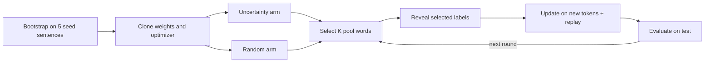

# uq-pet-token: token-level active learning for NER

Does a token classifier learn faster when each online update uses its most uncertain
unlabelled words instead of the same number of random words?

This is the token-level counterpart of
[DogRog/uq-pet](https://github.com/DogRog/uq-pet), which selects whole sentences by
LLM uncertainty and fine-tunes on them.

Experiments run on [PET](https://github.com/patriziobellan86/PETv1.1) by default, a
corpus of business-process descriptions annotated with 7 process entity types (actors,
activities, gateways, and others; 15 BIO tags). [CoNLL-2003](https://huggingface.co/datasets/eriktks/conll2003)
is available as a second dataset. The supplied configurations cover DistilBERT, BERT,
RoBERTa, DeBERTa-v3, and ModernBERT.

The project includes:

- an interactive marimo experiment for one UQ metric against random;
- random-baseline hyperparameter tuning on a validation holdout;
- fixed comparisons of all three UQ metrics using the tuned winners;
- a fully supervised upper bound;
- resumable random hyperparameter sweeps; and
- read-only analysis notebooks for saved results.

## Quick start

Use Python 3.12 or newer and `uv`. From the project root:

```bash
uv sync
uv run marimo edit notebooks/bert_token_uq.py
```

In the editor, choose settings and press **Run experiment** to start a real run. Real
runs download PET and model weights when needed; PET is cached at
`data/raw/PETv1.1-entities.jsonl`. Use `uv run marimo run notebooks/bert_token_uq.py`
for the app view without the code editor.

Running the notebook as a plain script (`uv run notebooks/bert_token_uq.py`) only
validates it with small synthetic display data. It downloads nothing and trains nothing.

To log to Weights & Biases, put `WANDB_API_KEY` in the environment or in a `.env` file
at the project root (see [Weights & Biases](#weights--biases)).

| Task | Entry point |
| --- | --- |
| Run one UQ metric against random | `notebooks/bert_token_uq.py` |
| Tune random acquisition on a validation holdout | `scripts/tune_random_all_models.sh` |
| Compare all UQ metrics with saved validation winners | `scripts/run_best_uq_all_models.sh` |
| Tune and train the fully supervised upper bound | `scripts/run_supervised.py` |
| Sample hyperparameters and compare UQ against random | `scripts/bert_token_uq_search.py` |
| Inspect tuning completeness and winners | `notebooks/random_baseline_analysis.py` |
| Compare best-config UQ results and learning curves | `notebooks/best_uq_analysis.py` |
| Inspect random-search test curves and selections | `notebooks/random_search_analysis.py` |

## Protocol



### Data splits

PET is split 80/20 into train and test with a fixed seed. Five train sentences become the
labelled seed and the rest form the unlabelled pool: **5 seed, 328 pool, and 84 test
sentences**. Setting `"dataset": "conll2003"` (or choosing it in the notebook) runs the
same protocol on CoNLL-2003, loaded from `eriktks/conll2003` at a pinned revision. Its
5 seed sentences and pool (14,036 sentences) come from CoNLL train, and evaluation uses
the full CoNLL test split (3,453 sentences).

`dataset_percent` keeps that percentage of either dataset's pool. Smaller pools are
nested prefixes of one seeded shuffle, and the seed and test sentences do not change.

### One run

For every model seed:

1. Fine-tune a fresh token classifier (15 PET tags, 9 CoNLL tags) on the five seed
   sentences.
2. Clone the exact fitted weights and optimizer state into uncertainty and random arms.
3. Evaluate both arms before acquisition (round 0).
4. At each round, acquire `K` previously unseen pool words, or the remaining budget
   in the final round:
   - uncertainty selects the largest score from the configured UQ metric;
   - random draws uniformly from its remaining word pool.
5. Reveal only the selected labels.
6. Continue each arm from its current weights and optimizer state using the new
   token-centred items plus limited replay.
7. Evaluate on the held-out test set and repeat.

The full sentence remains model input, but each online training item labels exactly
one word. Only its first subword contributes to loss; every other position is `-100`.
By default, each round replays up to one older labelled token per new word, including
seed tokens. Replay scales down with a smaller final round. A 100% pool budget acquires
every scoreable word; lower percentage budgets round down only to a whole number of words.

### UQ metrics

All three metrics use the first subword's class probabilities, and larger values mean
more uncertain:

- `entropy`: normalized predictive entropy.
- `least_confidence`: one minus the largest class probability.
- `margin`: one minus the gap between the two largest class probabilities.

### Invariants

- The test set is evaluation-only.
- Pool inputs passed to uncertainty scoring contain no labels.
- A label is read from the private pool lookup only after its word is selected.
- Acquisition is without replacement and counts newly labelled words.
- First subwords are used consistently for scoring, online loss, and evaluation.
- Continuation subwords, padding, and special tokens are ignored.
- Truncated pool words are not selectable; truncated test words are an error.
- A word is truncated if any of its subwords are missing, including at the left boundary.
- Both arms begin from the same fitted state and receive the same update budget.
- The uncertainty and random arms keep separate weights and optimizer histories.
- Selection and replay use deterministic local random generators.
- Training uses the seed for each arm and round for dropout as well as shuffling,
  restoring the surrounding RNG states even if an update fails.

## Interactive experiment

The notebook uses the validated defaults in `src/uq_pet/config.py`:

| Setting | Default |
| --- | --- |
| Dataset / pool percentage | `pet` / `100` |
| Checkpoint / model seeds | `distilbert-base-cased` / `0,1,2,3,4` |
| UQ metric / new words per round | `entropy` / `32` |
| Pool acquisition budget | `100%` of scoreable words |
| Bootstrap epochs / online update passes | `20` / `1` |
| Replay ratio | `1` older labelled token per new word |
| Learning rate / weight decay | `5e-5` / `0.01` |
| Training / scoring batch size | `8` items / `256` sentences |
| Maximum tokenizer length | `256` |
| Concurrent seeds / precision | `1` / `auto` |
| W&B logging | Disabled |

Saved sweep and winner configurations override these defaults. The entity F1, macro
entity F1, and token-accuracy charts appear after bootstrap evaluation and update live
after both arms finish every round. The notebook also shows selected label counts, the
run description, paired gap against random, cumulative NER-tag coverage, and the
token-level selection log. A completed run writes:

```text
results/bert_token_uq_<timestamp>/
├── config.json
├── results.csv
└── selections.json
```

Passing one JSON object starts the same run without the UI:

```bash
uv run notebooks/bert_token_uq.py --config-json \
  '{"checkpoint":"microsoft/deberta-v3-base","model_seeds":[0],"update_passes":2,"learning_rate":0.00003}'
```

## Workflow

The main study has three stages: tune the random baseline on validation, freeze each
model's winner, and compare all UQ metrics against random on test. The supervised
baseline adds an upper bound.

### 1. Tune the random baseline

`--mode tune-random` searches hyperparameters with **random selection only**, saves the
validation winner, and stops. It never launches UQ acquisition or reads the test split.

```bash
bash scripts/tune_random_all_models.sh --dry-run
bash scripts/tune_random_all_models.sh
```

The launcher tunes all five models sequentially and stops on the first failure. Rerun
it to resume saved searches. To tune one model:

```bash
uv run scripts/bert_token_uq_search.py --config configs/tune_random/distilbert_tune_random_100.json --dry-run
uv run scripts/bert_token_uq_search.py --config configs/tune_random/distilbert_tune_random_100.json
```

Each `configs/tune_random/*_tune_random_100.json` samples 100 configurations with five
model seeds, two seed workers, the same validation split and objective, and its own
output folder. A dry run prints the plan without loading data or models.

1. Keep the original seed and test sentences. Hold out 66 pool sentences for
   validation with a fixed local RNG (on PET, 262 acquisition sentences remain).
   Validation sentences cannot be acquired or replayed.
2. Train only random selection for each sampled configuration (see
   [Search space](#search-space)). Maximize the seed-mean normalized validation
   entity-F1 AUC against acquired-pool percentage, including round 0. To optimize the
   endpoint instead, set `objective` to `random_validation_final_entity_f1` before
   starting. Ties use ascending config ID.
3. Save the winning hyperparameters and validation score, then exit.

The inherited `uq_metric` field is unused in this mode and is omitted from new trial
metadata and winning settings.

Outputs under `results/random_baseline_search/<sweep-name>/`:

- `plan.json` and `split.json`: fixed search settings and validation split provenance.
- `tuning/<config-id>/`: validation settings, results, selections, progress, and completion score.
- `best_config.json`: winning experiment settings, ready for a separate experiment.
- `selection.json`: winner ID, objective, and validation score.
- `summary.json`: every trial's status and score; complete after both winner files exist.

Repeat the tuning command to resume. Completed trials are reused and interrupted trials
restart from bootstrap. Exact saved learning rates are kept despite tiny sampling
roundoff on comparison.

The winner is the best sampled configuration on this validation split, not a guaranteed
global optimum. Keep its settings frozen when assessing UQ methods; do not choose new
hyperparameters from test results.

### 2. Compare UQ metrics with the winners

The checked-in winners are in `configs/best_uq/`, with provenance in
[configs/best_uq/README.md](configs/best_uq/README.md). Run all of them with all three
UQ metrics (five models × three metrics × five seeds, with matched random baselines):

```bash
bash scripts/run_best_uq_all_models.sh --dry-run
bash scripts/run_best_uq_all_models.sh
```

Pass `--uq-metrics entropy margin` to run a subset. Models run sequentially, with
parallel seeds within each model, and the script stops on the first failure.

To run one configuration, including a newly tuned `best_config.json`:

```bash
uv run scripts/run_uq_metrics.py --config configs/best_uq/bert_base.json
uv run scripts/run_uq_metrics.py \
  --config results/random_baseline_search/distilbert-random-baseline-100/best_config.json
```

This compares entropy, least confidence, and margin using exactly one supplied
configuration. No hyperparameters are sampled. Bootstrap training and the matched random
baseline are shared across metrics. The saved best-UQ configs run all five seeds
concurrently; use `--seed-workers N` to override this. Configs without `seed_workers`
default to two concurrent seeds. `--dry-run` prints the validated plan without
downloading data or training, `--config-json` accepts inline JSON instead of a file, and
`--sweeps-dir` changes the output parent directory.

Results are grouped under `results/best_uq/<checkpoint>-best-uq/`, with `plan.json`,
`search_config.json`, `summary.json`, and per-metric outputs under
`runs/config_0000/<metric>/`. Each metric keeps its settings, evaluation rows, and
selected tokens. Re-running skips completed comparisons; an interrupted comparison
restarts. Changed scientific settings require a new `--sweep-name`.

### 3. Supervised upper bound

Following Vacareanu et al. (LREC-COLING 2024), the fully supervised baseline gives the
upper bound for active learning. A fresh pretrained model is trained on fully labelled
sentences for a fixed number of epochs (default 20, no early stopping). Only first
subwords are supervised, and truncated pool words are excluded as in acquisition.

1. **Grid search on validation.** Every combination of learning rate
   (1e-5, 2e-5, 3e-5, 5e-5, 1e-4), batch size (8, 16, 32), and weight decay (0, 0.01)
   is trained for each model seed on the seed sentences plus the tuning pool, then
   scored on the same 66-sentence validation holdout used by random-baseline tuning.
   The highest seed-mean validation entity F1 wins; ties go to the lowest config ID.
   The test split is not read.
2. **Test runs.** The frozen winner is retrained from scratch for each seed on the seed
   sentences plus `sentence_percents` of the full pool, then evaluated once on the test
   split. The default `[100]` uses the complete training set. Other percentages, such
   as `[10, 50, 100]`, take nested prefixes of a label-free, seed-specific sentence
   order for a sentence-level annotation curve.

```bash
uv run scripts/run_supervised.py --config configs/supervised/distilbert.json --dry-run
uv run scripts/run_supervised.py --config configs/supervised/distilbert.json
bash scripts/run_supervised_all_models.sh
```

`--stage tune` stops after freezing the winner, and `--stage test` requires it. Rerunning
resumes. Completed trials and budgets are skipped, and failed ones are retried. Adding
percentages later reuses the saved tuning. Changing the grid, epochs, seeds, checkpoint,
validation split, or effective precision requires a new `sweep_name`, which defaults to
`<checkpoint>-supervised`.

Outputs under `results/supervised/<sweep-name>/`:

- `plan.json`, `split.json`, and `run_config.json`: the frozen grid and settings.
- `tuning/<config-id>/`: validation rows per seed and `completed.json` with the score.
- `best_config.json` and `selection.json`: the winning settings and validation score.
- `test/pool_<percent>pct/`: test rows per seed, the chosen sentences, and the mean
  and standard deviation of test entity F1.
- `summary.json`: every trial's status, the winner, and every test budget.

### 4. Analyze saved results

```bash
uv run marimo edit notebooks/random_baseline_analysis.py
uv run marimo edit notebooks/best_uq_analysis.py
uv run marimo edit notebooks/random_search_analysis.py
```

These notebooks read saved files and do not train models.

- `random_baseline_analysis.py` reads `results/random_baseline_search/` and shows trial
  completeness and the highest-scoring configuration in each completed sweep.
  Incomplete sweeps are excluded from the winner table.
- `best_uq_analysis.py` compares the fixed comparisons in `results/best_uq/`. It draws
  the supervised test rows for the selected checkpoint as a dashed reference line with a
  ±1 SD band, plus the sentence-level curve when several percentages were run. The AL
  arms use their own online recipe, so this line marks the value of labelling
  everything rather than a matched-hyperparameter arm.
- `random_search_analysis.py` reads test sweep summaries under `results/random_search/`,
  with aggregate metric results, pending or failed comparisons, and a per-configuration
  drill-down. It plots seed means and standard-deviation bands for entity F1, macro
  entity F1 (when available), and token accuracy, plus acquired NER-tag coverage and
  selected words with sentence context. Sentence context is read from the local
  `data/raw/PETv1.1-entities.jsonl`, so it covers PET sweeps only.

## Random hyperparameter sweep

In its default `--mode compare`, `scripts/bert_token_uq_search.py` samples a fixed
set of configurations and runs entropy, least confidence, and margin against a matched
random arm for each, evaluated on the **test** split after round 0 and every acquisition
round. There is no validation holdout, optimization objective, pruning, or best-gap
selection. Treat it as exploratory; the tuned workflow above is the main comparison.

```bash
uv run scripts/bert_token_uq_search.py --config configs/random_search/distilbert_random_5_seeds.json
```

The five files in `configs/random_search/*_random_5_seeds.json` each budget
**30 hyperparameter configurations × 3 UQ metrics = 90 paired comparisons**, with five
model seeds run concurrently and 100% pool acquisition.

Sampling uses independent uniform categorical draws and log-uniform learning-rate draws
with a local seeded RNG. The whole plan is saved before loading data or training, and
scores never change the plan, run order, or budget. Each configuration uses the same
sampled learning rate across all model seeds and acquisition arms. `uq_metric` is not
sampled. Values for sampled fields in the input configuration are overwritten by the
saved plan, and other settings stay fixed. Identical sampler seeds and budgets give
identical sampled configurations across checkpoints.

For each configuration and seed, bootstrap runs once. Its fitted weights and optimizer
state are held in CPU memory and cloned into each arm. The first UQ metric trains beside
random; later metrics train their own UQ arms and reuse the random evaluation rows and
selected-token records. At most two learner states reside on the GPU per seed (plus
transient BF16 execution copies and activations). All three UQ trajectories keep
separate model and optimizer histories. The shared random baselines are repeated
observations of one baseline, not independent observations to pool across metrics.

Use `--config` or `--config-json`, with optional overrides `--num-configs`,
`--sweep-name`, `--sweeps-dir`, and `--sampler-seed`. `num_configs` is required and is
the **total fixed budget**, not an additional-run count. A valid command starts real
training. For example:

```bash
uv run scripts/bert_token_uq_search.py \
  --num-configs 10 --sweep-name distilbert-random-10 \
  --config-json '{"checkpoint":"distilbert-base-cased","model_seeds":[0,1,2,3,4]}'
```

Choose the search space and budget before inspecting test curves; changing them in
response to favorable test gaps would make the resulting assessment exploratory.

Outputs under `results/random_search/<sweep-name>/`:

- `plan.json`: immutable sampled configurations, all UQ metrics, seeds, and fixed settings.
- `search_config.json`: settings of the latest accepted invocation.
- `runs/<config-id>/<metric>/progress.csv`: atomically updated test rows after each
  completed round pair, including round 0.
- Each completed comparison saves `config.json`, `results.csv`, and `selections.json`
  in a timestamped run directory, referenced by `completed.json`.
- `summary.json`: every planned comparison, its pending/failed/complete status, and
  per-metric mean test F1 gap AUC, mean final F1 gap, wins, ties, losses, and win fraction.
  Failed comparisons keep their error and are retried on resume.

The AUC integrates UQ minus random entity F1 against acquired-pool percentage,
normalizes by the observed acquisition interval, and averages across seeds. Each
configuration has equal weight in per-metric summaries; wins use its seed-mean AUC
gap, with absolute gaps at most 1e-12 treated as ties. Incomplete sweeps are explicitly
marked, with completed and planned counts. No configuration is ranked or selected.

## Reference

### Search space

Random-baseline tuning and the random sweep sample the same ranges:

| Setting | Values |
| --- | --- |
| `k` | 32, 64 |
| `bootstrap_epochs` | 10 |
| `update_passes` | 1, 2, 4 |
| `learning_rate` | Log-uniform from 0.000001 to 0.0001 |
| `batch_size` | 32, 64 |
| `replay_ratio` | 0, 1, 2 |
| `weight_decay` | 0, 0.01 |

The 72 categorical combinations can repeat with different learning rates, so there is
no finite grid limit on the budget.

### Resuming

Running the same search, tuning, or comparison command resumes it. Completed outputs are
kept and unfinished configurations restart together from bootstrap; model and optimizer
checkpoints are not saved. Exports already marked complete are kept even if saving a
later metric fails.

Only `seed_workers` and W&B settings may change without changing the scientific plan.
Changing the budget, sampler seed, checkpoint, model seeds, search ranges, or other
scientific settings requires a new sweep name. Run only one process per sweep. Updating
the code or config does not alter an already running process.

### Concurrency and performance

To share a large GPU across independent seeds, set **Concurrent seeds** in the notebook
or pass `seed_workers` in JSON (default `1`):

```bash
uv run notebooks/bert_token_uq.py --config-json \
  '{"model_seeds":[0,1,2,3,4],"seed_workers":2,"score_batch_size":128}'
```

Workers use separate spawned processes on the selected device, each owning both arms
and their optimizer and RNG states. Start with two workers, then increase if measured
throughput improves and peak GPU memory permits. The worker count is capped at the
number of seeds. Each seed's rounds remain sequential, and learners run sequentially
within each seed. Live updates append only complete two-arm rounds as they arrive, and
saved records keep the configured seed order. Errors or interruption stop the remaining
workers. In sweeps, metrics run sequentially within a seed and share one bootstrap and
random trajectory, so different seeds may be working on different metrics at the same
time.

Pool and evaluation tokenization and first-subword positions are cached once per seed.
Uncertainty is computed in batches on the model device, transferring only one score per
remaining word to the CPU. `score_batch_size` (default **256 sentences**) applies to
both pool scoring and test evaluation. Raising it can improve inference throughput; it
does not change the number of words acquired or the training batch size. Device
reductions can produce small floating-point differences, which can affect acquisition
order for nearly tied scores.

`precision` defaults to `"auto"`: native BF16 autocasting on supported CUDA GPUs (such as
the RTX 4090), and FP32 on other devices. Bootstrap, online training, pool scoring, and
test evaluation all use the same resolved precision. Parameters and AdamW state stay
FP32, and scoring converts first-subword logits to FP32 before softmax and uncertainty
reduction. BF16 uses no gradient scaler. Set `"precision":"fp32"` for a full-precision
comparison, or `"precision":"bf16"` to require native CUDA BF16 support and fail early
otherwise. The notebook exposes the same selector. Exports record the requested
`precision` and `effective_precision`; a sweep's plan also locks the latter across
resumes. BF16 can change predictions and acquisition order, so compare speed and
learning curves under a new sweep name rather than mixing precision within a sweep.

### Weights & Biases

Set `"wandb_enabled": true` and `"wandb_project": "your-project"` to log runs. Online
logging requires `WANDB_API_KEY` in the process environment or the project's `.env`
file and validates it before loading data or training. Exported environment variables
take precedence over `.env` values. `WANDB_MODE=offline` writes local W&B records without
credentials and has no online project link.

**Comparison runs.** The CLI prints the project and run URLs when round 0 arrives. Each
configuration, UQ metric, and seed has its own W&B run, grouped under the sweep name,
with both UQ and random curves against acquired-pool percentage. Logging stays in the
parent process and publishes only completed comparison pairs. Runs close on completion
or failure. Console capture is disabled in sweep and notebook runs, so terminal progress
redraws are not uploaded as `output.log`. On resume, completed comparisons are not
uploaded retroactively, and an unfinished configuration gets fresh W&B runs so its new
trajectory is not appended to an interrupted one.

**Tuning sweeps.** The five tuning configs enable W&B and use separate projects:
`distilbert-random-baseline`, `bert-base-random-baseline`, `roberta-base-random-baseline`,
`deberta-v3-base-random-baseline`, and `modernbert-base-random-baseline`. Online runs
create a real W&B sweep and a saved workspace chart automatically. The local seeded plan
still schedules the search; no W&B agents or UQ runs are launched. W&B logs validation
random metrics only.

The sweep contains **one summary run per completed configuration**, averaged over all
model seeds. Its objective is `random_validation_entity_f1_auc` (or the configured
endpoint objective). The saved parallel-coordinates chart includes learning rate (log
scale), batch size, `k`, update passes, replay ratio, weight decay, final validation F1,
and validation F1 AUC, with the objective as its last/color axis. Constant
checkpoint/bootstrap settings and per-seed live logs are excluded from it.

Sweep IDs, chart links, and published configuration IDs are saved in `wandb_sweeps.json`.
Resuming reuses the sweep and publishes any completed configurations not yet uploaded.
A completed search can be published without loading data or training:

```bash
uv run scripts/bert_token_uq_search.py --config configs/tune_random/distilbert_tune_random_100.json --publish-wandb-only
```

This requires an existing local plan and online W&B credentials. Offline mode keeps
per-seed local logs; create the online sweep later with the publication command.

### Legacy outputs

- Comparison sweeps use plan version 4, tuning plan version 3, and fixed comparisons
  plan version 1. Sweeps created with the earlier sampler need a new sweep name; their
  outputs stay readable and untouched.
- Older two-stage tuning sweeps resume when their tuning settings match: `plan.v2.json`
  keeps the original plan, and historical `final/` artifacts are left untouched.
  Resuming never starts or resumes those historical UQ comparisons.
- The Optuna workflow has been removed. Existing `results/optuna` artifacts contain
  validation evaluations and are excluded from test analysis.
- `notebooks/fixed_all_metrics_analysis.py` analyzes one historical sweep,
  `results/sweeps/bert_token_uq_20260825_090329_945236_fixed-all-metrics/`, and needs
  its `combined_results.csv` and selection files. It is not a general viewer.

## Development

### Checks

```bash
uv run pytest
uv run ruff check src tests notebooks scripts
uv run ruff format --check src tests notebooks scripts
uv run marimo check notebooks/bert_token_uq.py
uv run notebooks/bert_token_uq.py
uv run scripts/bert_token_uq_search.py --help
uv run scripts/run_uq_metrics.py --help
bash scripts/run_best_uq_all_models.sh --dry-run
bash scripts/tune_random_all_models.sh --dry-run
bash scripts/run_supervised_all_models.sh --dry-run
```

Contributor and agent conventions are in [AGENTS.md](AGENTS.md).

### Layout

| Path | Purpose |
| --- | --- |
| `src/uq_pet/pet_data.py` | PET and CoNLL-2003 identity, download, stable splits, and private label lookup |
| `src/uq_pet/token_model.py` | masking, training, UQ metrics, inference, and evaluation |
| `src/uq_pet/active_learning.py` | acquisition rounds, replay, orchestration, and outputs |
| `src/uq_pet/config.py` | shared validated experiment and search configuration |
| `src/uq_pet/experiment.py` | run execution and label coverage summaries |
| `src/uq_pet/search.py` | random sweep or baseline tuning, shared execution, resume, and summaries |
| `src/uq_pet/supervised.py` | supervised grid search, fixed-epoch test runs, resume, and summaries |
| `src/uq_pet/utils/truncation.py` | word alignment and truncation checks |
| `src/uq_pet/utils/wandb_logging.py` | W&B credentials, evaluation records, and comparison run lifecycles |
| `src/uq_pet/utils/wandb_tuning.py` | tuning sweep publication and workspace charts |
| `scripts/bert_token_uq_search.py` | CLI entry point for search and tuning |
| `scripts/run_uq_metrics.py` | fixed multi-metric comparisons from one experiment configuration |
| `scripts/run_supervised.py` | CLI entry point for the supervised baseline |
| `scripts/run_best_uq_all_models.sh` | fixed comparisons for all five saved winners |
| `scripts/tune_random_all_models.sh` | random-only tuning for all five checkpoints |
| `scripts/run_supervised_all_models.sh` | supervised baseline for all five checkpoints |
| `notebooks/bert_token_uq.py` | controls, experiment run, tables, and plots |
| `notebooks/random_baseline_analysis.py` | trial completeness and best saved validation configurations |
| `notebooks/best_uq_analysis.py` | best-config UQ comparisons against random and the supervised bound |
| `notebooks/random_search_analysis.py` | random-sweep summaries and per-configuration drill-downs |
| `notebooks/fixed_all_metrics_analysis.py` | read-only analysis of one historical sweep |
| `notebooks/utils/` | chart builders, acquisition diagnostics, and W&B comparison media |
| `configs/best_uq/` | saved tuning winners for fixed UQ comparisons |
| `configs/tune_random/` | random-baseline tuning settings |
| `configs/random_search/` | sampled UQ-versus-random comparison settings |
| `configs/supervised/` | supervised baseline settings |
| `tests/` | offline protocol, model-boundary, CLI, concurrency, resume, and logging checks |
